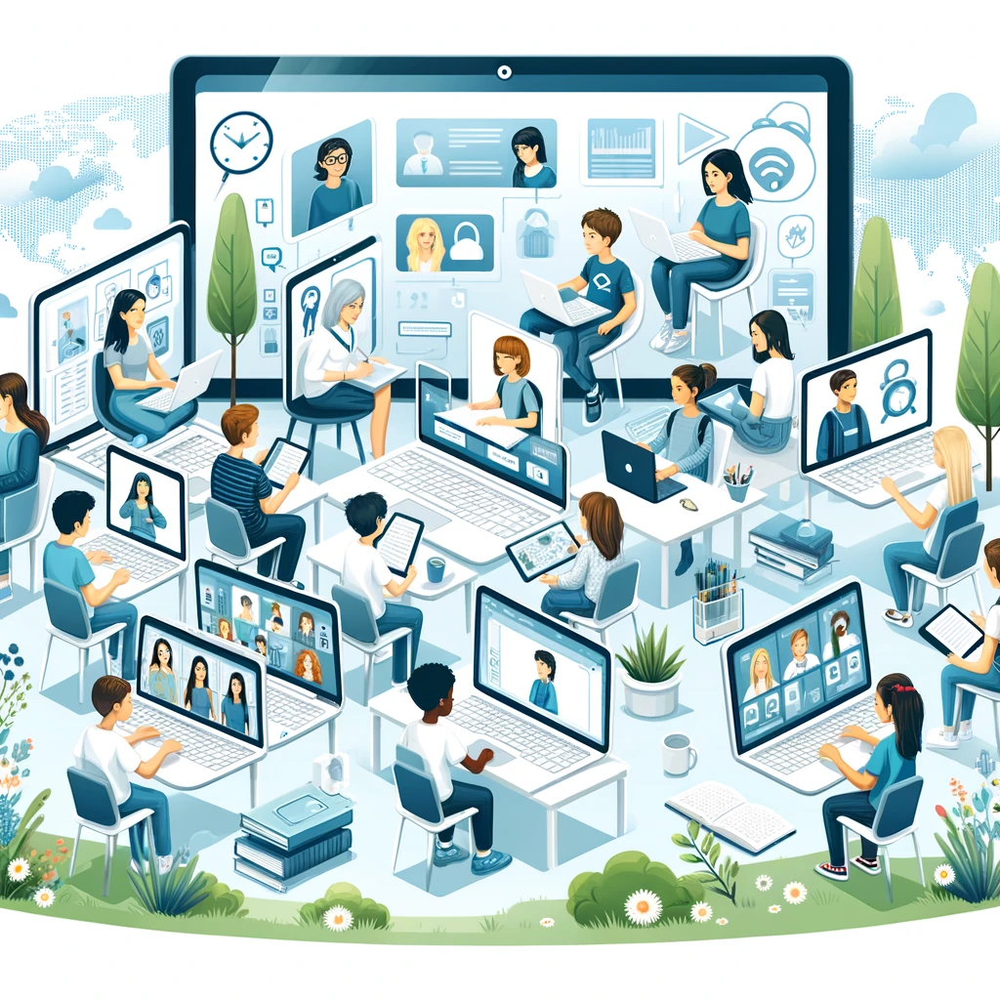
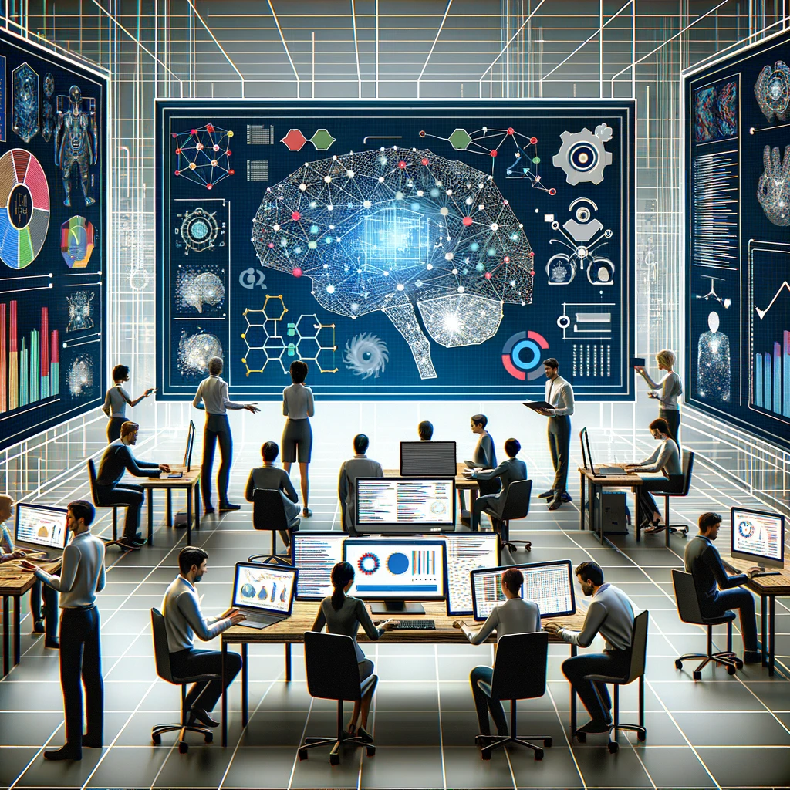

<!-- >> I believe in an architecture not on data. Intelligent come from architecture not from a lot of data.
             I believe in Tiny than large. Does the amount of knowledge make one intelligent ? oups I guess not, 
             Does good reasonning result in good outcomes, arguably yes. Does memory and brain are crucial? 
             I think so. Does AI will replace Humans or pause Existential risk? Ok, That is kind rude. 
             They say open source but they are they only who have power to train them ? Irony, Irony, Irony… -->

<blockquote style='color:grey;'>If you can't fly then run, if you can't run then walk. If you can't walk then crawl. But whatever you do you have to keep moving forward.

<cite>Martin Luther King. Jr. </cite> </blockquote> 

----

## About Me

I am Abari DODO, a junior engineer specialized in embedded systems and artificial intelligence. I hold an Engineering degree in embedded systems from the National School of Applied Sciences of Fez, Morocco, and a Master's degree in Artificial Intelligence from Université Claude Bernard Lyon 1 in France. My focus lies in the intersection of embedded systems and artificial intelligence, with a particular interest in designing AI models that can be executed at the edge (on devices). I am also fascinated by the broader applications of AI. Through my internship experiences, I have gained valuable insights into AI research and programming embedded systems. Here are some of the domains that capture my interest.

- Generative AI, Embedded AI, Computer vision

---------

## Education

- [M.Sc. in Artificial Intelligence from Université Claude Bernard](https://ensaf.ac.ma/)

- [M.Eng. (Diplôme d'ingénieur in French) in Embedded systems and industrial computing from National school of Applied Sciences Fez-Morrocco](https://www.univ-lyon1.fr/)

---------

## Projects

<!-- Maranta project -->

<h4 class='project'> <a href="https://github.com/abari111/maranta" style="background-color: #4CAF50; color: white; padding: 5px 5px; text-align: center; text-decoration: none; display: inline-block; border-radius: 8px; margin: 0px 0px; cursor: pointer;">
Maranta</a></h4>

Currently in the design phase, this project aims to create a personalized learning platform capable of developing individualized mental models for each learner. The underlying assumption is that everyone can master any subject or field, id they are provided with resources tailored to their needs.

<!-- EasyML project -->
---
<h4 class='project'> <a href="https://github.com/abari111/easyML" style="background-color: #4CAF50; color: white; padding: 5px 5px; text-align: center; text-decoration: none; display: inline-block; border-radius: 8px; margin: 0px 0px; cursor: pointer;">
   EasyML
</a></h4>
<!-- <h3 class='project'>EasyML</h3> -->

You learn by building projects, a functional system. It can be complex or simple, But the motto has to be Easy to understand, Easy to deploy. Easy, not simple, not complex but Easy !!!😉. It can be easy and be a complex system, can be easy and be simple. For those projects I use easy prefix.
You will find here  all small machine learning projects I built. from Data collection, building models to deployment with Flask, FastAPI etc.

<!-- iMBA project -->
---
<h4 class='project'> <a href="https://github.com/abari111/iMBA" style="background-color: #4CAF50; color: white; padding: 5px 5px; text-align: center; text-decoration: none; display: inline-block; border-radius: 8px; margin: 0px 0px; cursor: pointer;">
   iMBA
</a></h4>

Having an MBA from a renowned institute opens doors, allowing us to take a significant leap in our career. Pursuing an MBA is costly and requires resources. Inspired by the Personal MBA by Josh Kaufman, I decide to create a customized MBA program for myself and make it public. If you have stumbled upon this repository by chance, let me tell you one thing: I am not an expert, and I don't know anyone in my circle who has done an MBA. Until the opportunity presents to me, I content myself with this. Let build it collaboratively.

---
## My Pitch
<!-- - I build product not models
- I value trust
- Team work is everything, driven team to success and make individual strenght accountable
- I value long-term strategy than short-term strategy (the latter cost me a lot, the former convince me in my choices)
- I value Critical thinking then barely accepting things.
- Other people contributions are as important as mine.
- I like to work with people who know what they want (but they can accept positive critics)
- I don't like cheater, they fool theirself. Integrity and honesty are everything.
- I know what I want, but Know when it is impossible to get.
- Is it physically impossible to do it? No; is it  it? No; So you are saying, it is possible. -->
- I build products, not models.
<!-- - Trust and teamwork are paramount to me; I drive teams towards success while ensuring individual strengths are recognized and utilized. -->
- I prioritize long-term strategies over short-term gains. While short-term strategies have cost me, long-term planning reaffirms my decisions.
Critical thinking is essential to me; I don't just accept things at face value. - I value the contributions of others as much as my own.
- I appreciate working with people who are decisive yet open to constructive criticism.
- I have zero tolerance for dishonesty. - Integrity and honesty are fundamental values to me.
- I am clear about my goals but also realistic about their feasibility.
<!-- - If something is not physically impossible, I believe in exploring its potential to make it possible. -->

----
## More 
<!-- - Try to think about applications of AI that can help to reach sustainable development objectives
- How AI can be used to make education enjoyable and more impactful
- How African countries can leverage AI to solve their problems
- How companies can used AI to be more productive
- Implement more safe, secure AI 
- Develop AI ecosystem in my country (Niger)
- AI and sovereignty
- AI threats -->

- Consider the applications of AI that could contribute to achieving sustainable development goals.
- Explore how AI can be utilized to make education more enjoyable and impactful.
- Investigate how African countries can leverage AI to address their specific challenges.
- Examine how companies can use AI in their daily activities.
- Focus on implementing safer and more secure AI systems.
- Work towards developing an AI ecosystem in Niger.
- Consider the relationship between AI and national sovereignty.
- Analyze the potential threats posed by AI.
